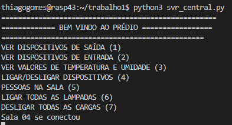
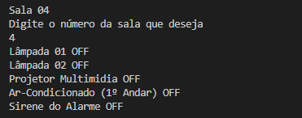

# FSE TRABALHO 1 2022.

Trabalho 1 da disciplina de Fundamentos de Sistemas Embarcados (2022/2)

Autor: Vinícius Vieira de Souza - Matrícula: 17/0115500

## Descrição
A descrição do projeto [aqui](https://gitlab.com/fse_fga/trabalhos-2022_2/trabalho-1-2022-2)

## Uso
### Passo 1:
Na placa que você escolheu como servidor central altere os campos do ip central e sua respectiva porta no arquivo configuracao_sala0x.json e nas placas escolhidas como distribuidas altere estes campos e o ip do distribuido e sua porta como no exemplo abaixo.
```json
    "ip_servidor_central": "164.41.98.15",
    "porta_servidor_central": 10342,
    "ip_servidor_distribuido": "164.41.98.15",
    "porta_servidor_distribuido": 10345
```  

## Passo 2:
Execute o servidor na placa escolhida como central na raiz do projeto execute:
```terminal
python3 svr_central.py
```
## Passo 3:
Em cada placa em que está o código do distribuido e suas configurações execute na raiz do projeto:

```terminal
python3 svr_distribuido.py
```
## Passo 4:
No terminal onde está rodando o servidor central deve aparecer o menu como esse abaixo:



Ao selecionar algumas das opções como "VER DISPOSITIVOS DE SAÍDA",deverá ser a escolhido a sala que deseja visualizar, a tela irá mostrar a cada dois segundos a atualização dos dispositivos como na figura abaixo



Para encerrar a visualização e voltar para o menu aperte Crtl + c
